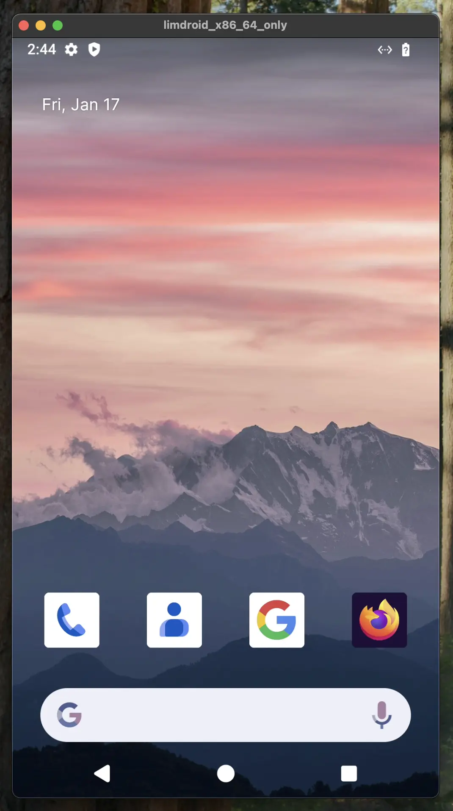

# Homebrew Tap for Limbar

This homebrew tap hosts the client machinery to create and connect Android emulator
instances in [Limbar](https://limbar.io)

## `lim` CLI

`lim` is the CLI users can use to manage all their Android emulator instances. It
enables users to:
- Remote control the Android emulator instances,
- Start an `adb` tunnel so that other tools can connect to the emulator instance such as,
  - `maestro` CLI that can execute tests,
  - `gradle` that can install & test Android application,
  - Android Studio that detects the instance as physical device and lets you use it as such,
  - React Native & Flutter machinery also recognizes the emulator instance.

### Quick start

There is a detailed documentation in [Limbar docs](https://limbar.io/docs) but here is the
quick way to get started.

Install `lim`:

```bash
# Available for both macOS and Linux.
brew install limbario/tap/lim
```

Start an emulator instance:

```bash
lim run android
```

Voila! Your online Android emulator instance is ready for development and testing!


